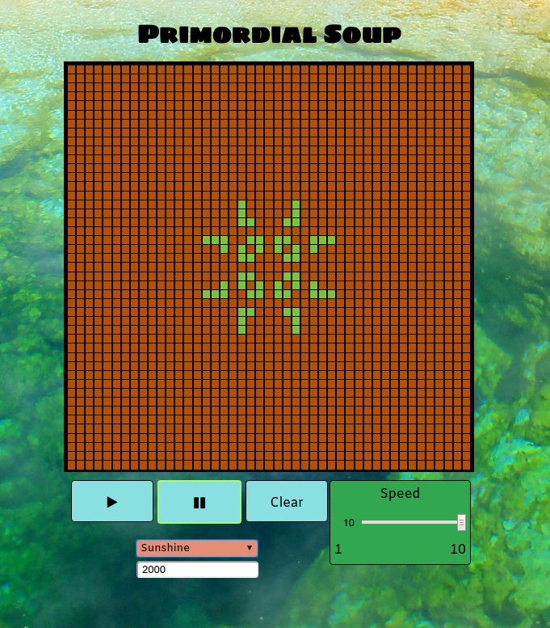

# Primordial Soup
[Play here](https://mc962.github.io/conways/)

## Description

Primordial Soup is a based off Conway's Game of Life. It is written in JavaScript and
jQuery for DOM manipulation. The game has several main rules. There are "live cells",
as represented by the green squares, and "dead cells", as represented by the orange squares.
A live cell with less than 2 neighbors dies from isolation. A live cell also dies from overpopulation if it has 4 or more neighbors.
A dead cell space with exacly 3 neighbors will come to life in the next turn.

## How to Play

Select a shape from the dropdown menu. Some shapes require a certain board size to be displayed properly,
so adjust the board size in the number input as needed. Press *Play* to start the simulation and *Pause* to
stop the simulation. Pressing *Clear* will clear all the "live" squares from the board. The slider on the right
can be used to increase or decrease the speed as desired. A square can be manually toggled between "live" and "dead"
by clicking on the square with the mouse. This can be used to create or modify patterns for interesting combinations.

## Features to add

- Multiplayer - Currently the game is designed as a single-player simulation. In the future different color tiles can be added,
each color representing an individual player. The rules for a player's own tiles would be similar to the classic Conway's Game of life
simulation. However, when 2 different player colors meet, different logic would come into play.
The 2 cells would compare who had the least neighbors of their own type compared to the other,
and whoever has the least would lose. In the event of a tie a possible mechanic would be to either do nothing,
or two randomly decide the winner. Players would have turns, and during each turn a tile of the player's own color
would be able to placed, with a timer in place to make sure no player monopolizes the game time in order to unfairly win.
The first player to lose every tile would lose.

- WebSockets - As the above multiplayer would involve interaction between 2 individual players, some form of backend would be needed.
Because this type of game would need to be updated in real-time, an appropriate protocol such as WebSockets would be necessary.
The exact implementation depends on the choice of backend, but since the application is already JavaScript based and requires a lightweight, simple
backend, socket.io together with Node.js might be an appropriate choice.

## Screenshot

