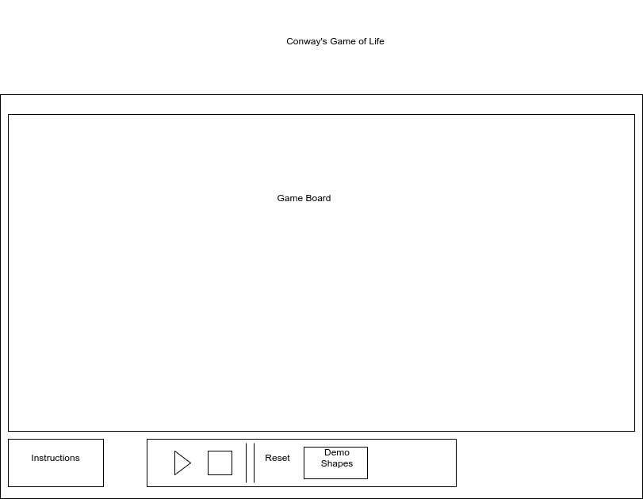

# Conway's Game of Life
## MVP
Conway's Game of Life is an example of a 'cellular automaton' game consisting
of a group of cells which, based on mathematical rules, may live,
die, or multiply.
## Features
Players should be able to populate the board by toggling spaces on the board on or off.
Player should be able to start, stop, and reset the board.
Player should be able to toggle between preset board patterns.

An About Modal explaining the game rules clickable from the main play screen.
Bonus:
Immigration: As represented by different colors, cells should take on whatever color
is represented by the majority of surrounding cells that gave birth to it.

## Technologies
The core of the game will be written with Vanilla JS, HTML, and CSS.
Canvas and Easel.js will be used to render the game.
Webpack will be used to bundle the scripts together.

There will be a `board.js` script responsible for holding the board logic,
and dealing with Easel.js.

There will be a `cell.js` script responsible for dealing with the logic for a particular
cell, such as alive or dead states, color, etc.

There will be a `movement.js` script responsible for tracking how the cell
should be moving across the board. It will deal with how to treat the surrounding
area of the cell, and react accordingly.

## Wireframes

## Timeline
- Day 1:
Set up board, learn basics of Easel.js enough to get objects such as a single static cell
rendering on the page.
- Day 2: Finish setting up the board, set up logic for the cell and make board clickable and cells toggleable. Start writing `movement.js` script.
- Day 3: Finish writing `movement.js` script. Add in preset patterns. Add in start, stop, speed, and reset buttons.
-Day 4: Polish the front-end and add Immigration if time.
